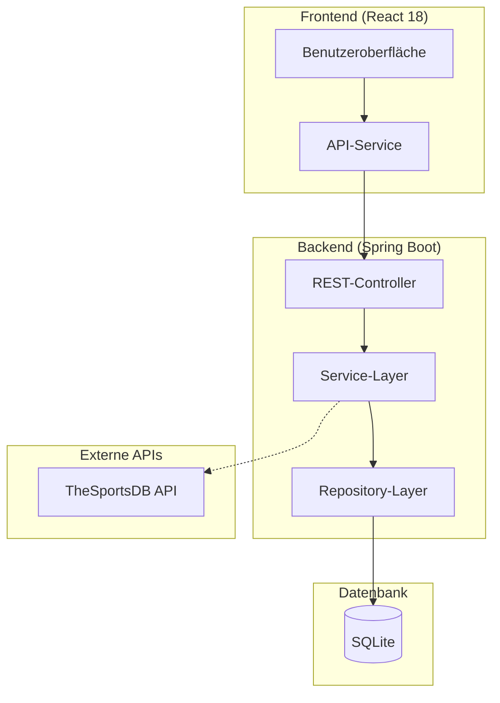
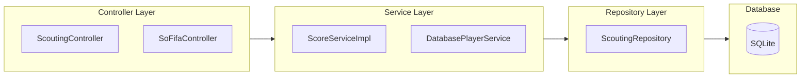
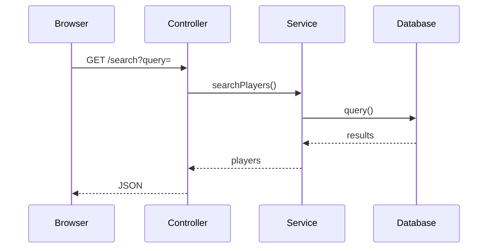

# ⚽ Transfermarkt Analyst Football

[](https://github.com/robpelz/transfermarkt-analyst-football/actions/workflows/ci.yml)
[](https://adoptium.net/)
[](https://spring.io/projects/spring-boot)
[](https://reactjs.org/)
[](https://sqlite.org/)
[](LICENSE)


**Eine Full-Stack-Webanwendung für professionelles Fußball-Scouting und Spieleranalyse.** Entwickelt mit Spring Boot 3.4.2, React 18 und SQLite.

---

## 📋 Inhaltsverzeichnis

1. [Über das Projekt](#-über-das-projekt)
2. [Features](#-features)
3. [Technologie-Stack](#-technologie-stack)
4. [Architektur](#-architektur)
5. [Screenshots](#-screenshots)
6. [Quick Start](#-quick-start)
7. [API-Endpunkte](#-api-endpunkte)
8. [Scoring-Algorithmus](#-scoring-algorithmus)
9. [Projektstruktur](#-projektstruktur)
10. [Tests & Coverage](#-tests--coverage)
11. [Lizenz](#-lizenz)

---

## 🎯 Über das Projekt

Dieses Projekt entstand als umfangreiche Portfolio-Arbeit, die den gesamten Entwicklungsprozess einer modernen Webanwendung abbildet – von der Datenbankmodellierung über das Backend mit REST-APIs bis hin zu einer interaktiven React-Frontend-Anwendung.

| Ziel | Beschreibung |
|------|--------------|
| **Full-Stack-Entwicklung** | Vollständige Anwendung mit Spring Boot (Backend) und React (Frontend) |
| **Scouting-Algorithmus** | Implementierung eines mehrdimensionalen Bewertungssystems für Spielertransfers |
| **Saubere Architektur** | Einhaltung von SOLID-Prinzipien und Schichtenarchitektur |
| **Testabdeckung** | Unit- und Integrationstests mit JUnit, Mockito und JaCoCo |
| **Professionelles UI/UX** | Responsive Design mit intuitiver Benutzerführung |

---

## ✨ Features

| Feature | Beschreibung |
|---------|--------------|
| 🔍 **Spielersuche** | Intelligente Suche mit Autocomplete und Fuzzy-Matching |
| 📊 **Spielervergleich** | Zwei Spieler direkt vergleichen mit visuellen Charts |
| 📋 **Scouting-Liste** | Vollständige CRUD-Operationen für gescoutete Spieler |
| 🏟️ **Vereinsübersicht** | Teams der Top-Ligen (Premier League, Bundesliga, Serie A, La Liga) |
| 🎯 **TransferScore** | Algorithmus-basierte Spielerbewertung (0-100 Punkte) |
| 🖼️ **Spielerbilder** | Dreistufiges System: Transfermarkt → TheSportsDB → UI Avatars |
| 📱 **Responsive Design** | Optimiert für Desktop, Tablet und mobile Endgeräte |
| 🔄 **CI/CD** | Automatisierte Pipeline mit GitHub Actions |

---

## 🛠️ Technologie-Stack

### Backend

| Technologie | Version | Zweck |
|-------------|---------|-------|
| Java | 22 | Programmiersprache |
| Spring Boot | 3.4.2 | Framework für REST-APIs |
| Spring Data JPA | 3.4.2 | Datenbankzugriff (ORM) |
| SQLite | 3.46.1 | Embedded-Datenbank |
| Hibernate | 6.6.5 | JPA-Implementierung |
| Maven | 3.9+ | Build-Tool |
| Lombok | 1.18.36 | Boilerplate-Code |

### Frontend

| Technologie | Version | Zweck |
|-------------|---------|-------|
| React | 18 | UI-Bibliothek |
| Vite | 5 | Build-Tool |
| Axios | 1.7 | HTTP-Client |
| Recharts | 2.12 | Diagramme |
| React Router DOM | 6 | Routing |

### Testing & DevOps

| Technologie | Zweck |
|-------------|-------|
| JUnit 5 / Mockito | Tests |
| JaCoCo | Coverage |
| GitHub Actions | CI/CD |

---

## 🏗️ Architektur

### Systemarchitektur



### Schichtenarchitektur



### Sequenzdiagramm – Spielersuche



---

## 📸 Screenshots

| | | |
|:---:|:---:|:---:|
|  |  |  |
| *Spieler-Suche* | *Spieler-Detail* | *Scouting-Liste* |

| |
|:---:|
|  |
| *Spielervergleich* |

---

## 🚀 Quick Start

### Voraussetzungen

| Software | Version | Prüfbefehl |
|----------|---------|------------|
| Java JDK | 22+ | `java -version` |
| Node.js | 22+ | `node -v` |
| Maven | 3.9+ | `mvn -version` |

### Backend starten

```bash
cd backend/transfermarkt-analyst
mvn spring-boot:run
```

Server: `http://localhost:8080`

### Frontend starten

```bash
cd frontend
npm install
npm run dev
```

App: `http://localhost:5173`

---

## 🔗 API-Endpunkte

| Controller | Methode | Endpoint | Beschreibung |
|------------|---------|----------|--------------|
| SoFifaController | GET | `/api/sofifa/search?query=` | Spielersuche |
| SoFifaController | GET | `/api/sofifa/player/{id}` | Spieler-Details |
| SoFifaController | GET | `/api/sofifa/player/{id}/score` | TransferScore |
| SoFifaController | GET | `/api/sofifa/compare` | Spielervergleich |
| ScoutingController | GET | `/api/scouting` | Alle Einträge |
| ScoutingController | POST | `/api/scouting/{playerId}` | Neuer Eintrag |
| ScoutingController | PUT | `/api/scouting/{id}` | Update |
| ScoutingController | DELETE | `/api/scouting/{id}` | Löschen |
| TeamLiveController | GET | `/api/live/teams/top-leagues` | Top-Ligen |
| TeamLiveController | GET | `/api/live/teams/by-league?league=` | Teams einer Liga |

---

## 📊 Scoring-Algorithmus

```
TransferScore = (Position × 30%) + (Preis × 25%) + (Alter × 20%) + (Erfahrung × 15%) + (Liga × 10%)
```

| Kategorie | Gewichtung | Kriterien |
|-----------|-----------|-----------|
| Position | 30% | Offensiv (75-85), Mittelfeld (70-80), Defensive (60-75) |
| Preis | 25% | Günstig = besser (95 Pkt <5Mio, 10 Pkt >100Mio) |
| Alter | 20% | Jung = besser (100 Pkt <21, 20 Pkt >35) |
| Erfahrung | 15% | Sweet Spot 28-32 Jahre (90 Pkt) |
| Liga | 10% | Liga-Qualität (70-95 Pkt) |

**Interpretation:** 85-100 = 🔥 Top-Transfer | 70-84 = ✅ Gutes Investment | 55-69 = ⚠️ Solide | 0-54 = ❌ Zu riskant

---

## 📁 Projektstruktur

```
transfermarkt-analyst-football/
├── backend/transfermarkt-analyst/
│   ├── src/main/java/.../controller/
│   ├── src/main/java/.../service/
│   ├── src/main/java/.../repository/
│   ├── src/main/java/.../model/
│   ├── src/test/java/.../
│   └── pom.xml
├── frontend/
│   ├── src/components/
│   ├── src/services/
│   └── package.json
├── transfermarkt1.png
├── transfermarkt2.png
├── transfermarkt3.png
├── transfermarkt4.png
└── README.md
```

---

## 📈 Tests & Coverage

```bash
cd backend/transfermarkt-analyst
mvn test
mvn jacoco:report
```

| Kennzahl | Wert |
|----------|------|
| Gesamtanzahl Tests | 213 |
| Testabdeckung | 62% |

---

## 📄 Lizenz

MIT Lizenz

---

## 👨‍💻 Autor

**Robert Pelz** · [GitHub](https://github.com/robpelz)

---

<div align="center">

**Built with passion for football analytics** ⚽

*© 2026*

</div>
